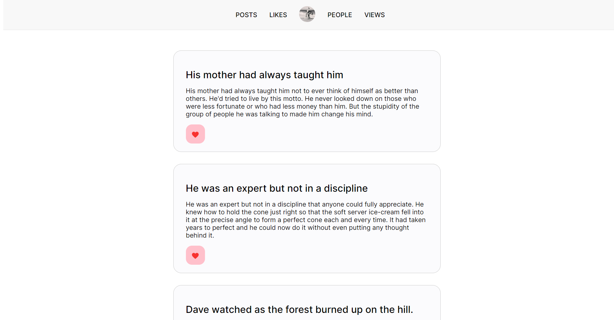
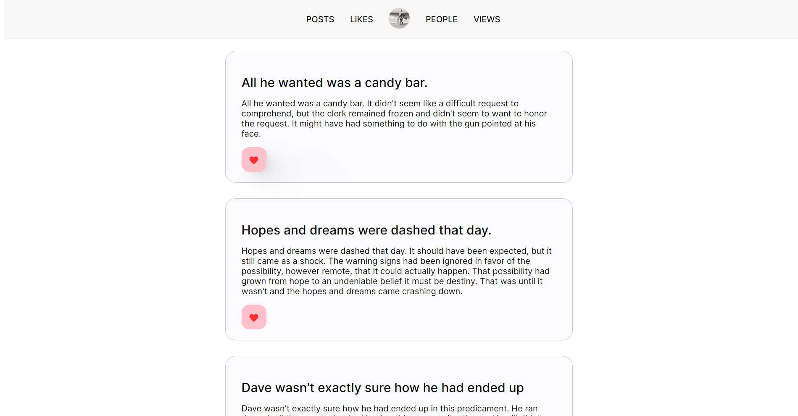

# Dummy Posts 🍭

This is a really simple angular application that was created by me 
to make use of some of the most interesting and useful concepts in Angular 🥵

- Components
- Services
- Dependency Injection & 
- Routing
  
So, this application just uses the dummy api (which is really cool btw 🤘). 
I used thier api to pull the dummy posts provided by them and then pass it to the component using dependency injection.

Btw, this is a Homework. LOL 😁

## To run the application

Just clone the code using `git clone` command.
Run `npm install` to make sure all the packages are installed.
Then `ng serve` to run the application on your system.

Kudos. 👋

# Demo Snaps 📸

<!-- add snap shots from /snaps -->

